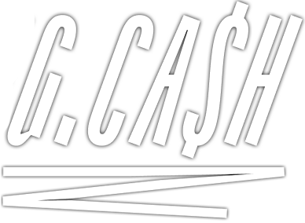

# Front ngcash



<br>

## Sobre o ngcash

- Realize seu cadastro utilizando *username* e *password.*
- Veja o seu saldo atual;
- Realize transferências para outros usuários a partir do *username*;
- Tabela com os detalhes de todas as suas transações;
- Filtre por data da transação ou tipo;

<br>

## Tecnologias

Tecnologias e ferramentas utilizadas no desenvolvimento do projeto:

- [NextJs](https://nextjs.org/)
- [ReactJs](https://pt-br.reactjs.org/)
- [TypeScript](https://www.typescriptlang.org/)

<br>

## Instalação e uso

```bash
# Abra um terminal e copie este repositório com o comando
git clone https://github.com/guerreiru/ngcash-app.git
# ou use a opção de download.

# Entre na pasta web com 
cd ngcash-app

# Instale as dependências
yarn install

# Rode a aplicação
yarn dev

# Abra http://localhost:3000 e veja a aplicação.
```

<br>

[](https://www.linkedin.com/in/guerreiru/) 
[](mailto:dev.fernandoguerreiro@gmail.com)
